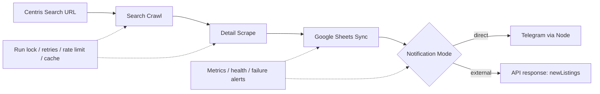

# Centris Scraper
Production-oriented TypeScript scraper for Centris real estate listings. It crawls Centris search results and detail pages, syncs listing state to Google Sheets, and can notify either Telegram directly or an external workflow such as n8n. The project is designed for a single host with filesystem-backed state, retries, health reporting, and cross-process run locking.

## Key Capabilities
- Search-page crawl with global deduplication by `listingId`
- Detail-page scraping for price, address, taxes, parking, broker, assessments, and more
- Google Sheets sync through Apps Script with `NEW`, `UPDATED`, and `UNCHANGED` classification
- Direct Telegram notifications for new listings in CLI mode
- Local HTTP API for n8n-driven notification workflows
- Shared retry policy, rate limiting, persistent detail cache, run lock, metrics, and health state

## Architecture


## Requirements
- Node.js `18.18+`
- Browser: Google Chrome (`BROWSER_CHANNEL=chrome`, default), Microsoft Edge (`BROWSER_CHANNEL=msedge`), or Playwright Chromium after `npm run playwright:install`
- Optional Google Apps Script web app for Sheets sync
- Optional Telegram bot and chat/channel for direct notification mode
- If Centris or Telegram is blocked from your network, use a VPN or outbound proxy; Telegram API calls respect `HTTPS_PROXY` / `HTTP_PROXY`

## Quick Start
```bash
npm install
cp .env.example .env
```

Required configuration before the first real run:
- Set `CENTRIS_SEARCH_URL` to the Centris search URL you want to monitor
- Keep `BROWSER_CHANNEL=chrome` or switch to `msedge` / `chromium`
- If you want Sheets sync, set `GOOGLE_APPS_SCRIPT_URL` and optionally `GOOGLE_APPS_SCRIPT_KEY`
- If you want direct Telegram notifications, keep `TELEGRAM_ENABLED=true` and set `TELEGRAM_BOT_TOKEN` and `TELEGRAM_CHAT_ID`
- If you do not want Telegram in CLI mode yet, set `TELEGRAM_ENABLED=false`
- If you want n8n integration, set `WORKFLOW_API_KEY`

Build and run one scrape:
```bash
npm run build
npm start
```

## Run Modes
| Command | Purpose | Notification mode |
|---|---|---|
| `npm start` | Run one compiled scrape and exit | `direct` |
| `npm run scheduler` | Build, then run fixed-delay scheduler | `direct` |
| `npm run api` | Build, then start local HTTP API on `127.0.0.1` | `external` |
| `npm run dev` | Watch `src/index.ts` for local development | `direct` |
| `npm run dev:scheduler` | Run scheduler entry without build output | `direct` |
| `npm run dev:api` | Run API entry without build output | `external` |
| `npm run playwright:install` | Install Playwright Chromium for `BROWSER_CHANNEL=chromium` | n/a |
| `npm run debug:detail` | Save one rendered detail page HTML and screenshot for debugging | n/a |

Notes:
- `npm start` runs `dist/index.js`, so build first
- `npm run scheduler` waits `SCHEDULE_INTERVAL_MINUTES` after each completed run before starting the next one
- `npm run api` binds only to `127.0.0.1`, so n8n must run on the same host or behind a local reverse-proxy setup

## Environment Variables
Never commit `.env`, bot tokens, workflow keys, or proxy credentials.

### Scraper
| Variable | Purpose | Default |
|---|---|---|
| `CENTRIS_SEARCH_URL` | Centris search URL to crawl | none |
| `BROWSER_CHANNEL` | `chrome`, `msedge`, or `chromium` | `chrome` |
| `HEADLESS` | Run browser headless | `true` |
| `SCRAPER_TIMEOUT_MS` | Browser timeout in ms | `60000` in `.env.example` |
| `SEARCH_PAGE_SIZE` | Listings per search page | `20` |
| `MAX_SEARCH_PAGES` | Maximum search pages to crawl | `20` |
| `SEARCH_MAX_LISTINGS` | Cap on unique listings per run | `500` |
| `DETAIL_CONCURRENCY` | Concurrent detail workers | `3` |
| `DETAIL_RECHECK_MODE` | `all` or `changed-only` | `all` |
| `DETAIL_RECHECK_HOURS` | Detail recrawl window | `24` |

### Google Sheets
| Variable | Purpose |
|---|---|
| `GOOGLE_APPS_SCRIPT_URL` | Apps Script web app endpoint |
| `GOOGLE_APPS_SCRIPT_KEY` | Optional shared key appended to the request |

Sheets sync uses `listingId` as the matching key, appends only unseen IDs, updates changed rows in place, and never deletes old rows.

### Telegram
| Variable | Purpose | Default |
|---|---|---|
| `TELEGRAM_ENABLED` | Enable direct listing notifications | `true` |
| `TELEGRAM_BOT_TOKEN` | Bot token for listing notifications and alerts | none |
| `TELEGRAM_CHAT_ID` | Target channel/chat for listing notifications | none |
| `TELEGRAM_PARSE_MODE` | Message format | `HTML` |
| `TELEGRAM_SEND_DELAY_MS` | Delay between messages | `500` |
| `TELEGRAM_MAX_RETRIES` | Per-message retry ceiling | `2` |
| `TELEGRAM_RETRY_DELAY_MS` | Fixed retry delay | `1000` |
| `FAILURE_ALERTS_ENABLED` | Enable Telegram failure alerts | `false` |
| `TELEGRAM_ALERT_CHAT_ID` | Optional alert target; falls back to `TELEGRAM_CHAT_ID` | empty |
| `FAILURE_ALERT_COOLDOWN_MINUTES` | Alert cooldown window | `60` |

### Proxy
| Variable | Purpose |
|---|---|
| `HTTPS_PROXY` | Proxy for Telegram API calls |
| `HTTP_PROXY` | Fallback proxy for Telegram API calls |

If PowerShell can reach Telegram but Node cannot, set the same proxy in `.env`.

### API
| Variable | Purpose | Default |
|---|---|---|
| `API_PORT` | Local API port for `npm run api` | `8787` |
| `WORKFLOW_API_KEY` | Shared secret expected in `x-workflow-key` | none |

Additional operational variables are defined in `.env.example` and `src/config/env.ts`, including `SCHEDULER_*`, `RUN_LOCK_*`, `METRICS_*`, `HEALTH_REPORT_*`, `RETRY_*`, `RATE_LIMIT_*`, `DETAIL_CACHE_*`, and `FAIL_TEST_*`.

## n8n Workflow
Recommended node flow:
1. `Schedule Trigger`
2. `HTTP Request`
3. `If` with `newCount > 0`
4. `Split Out` on `newListings`
5. `Telegram`

Suggested HTTP Request configuration:
- Method: `POST`
- URL: `http://127.0.0.1:8787/api/v1/runs/sentris`
- Header: `x-workflow-key: <your WORKFLOW_API_KEY>`
- Body: none
- Timeout: start with `180000` ms and increase if your search scope is large

Notification ownership:
| Mode | Used by | Behavior |
|---|---|---|
| `direct` | `npm start`, `npm run scheduler`, `npm run dev`, `npm run dev:scheduler` | Node sends Telegram notifications for new listings and acknowledges delivery back to the Sheet |
| `external` | `npm run api`, `npm run dev:api` | Node does not send listing notifications and does not acknowledge Telegram delivery; n8n owns downstream messaging |

Practical pattern:
- Filter on `{{$json.newCount > 0}}`
- Split `newListings` into individual items
- Build the Telegram message from fields such as `price`, `address`, `type`, `parking`, `municipalTax`, `schoolTax`, `brokerName`, and `propertyUrl`

## API Reference
### `POST /api/v1/runs/sentris`
- Binds to `127.0.0.1:<API_PORT>`
- Runs the same search, detail, Sheets sync, retry, cache, health, and locking pipeline as CLI mode
- Always uses `external` notification mode

Authentication:
- Set `WORKFLOW_API_KEY` in `.env`
- Send the same value in the `x-workflow-key` header

Successful response example:
```json
{
  "runId": "centris-20260715T120000",
  "status": "completed",
  "durationMs": 42350,
  "totalFound": 85,
  "newCount": 2,
  "updatedCount": 3,
  "unchangedCount": 80,
  "newListings": [
    {
      "listingId": "17042189",
      "price": 699000,
      "type": "Condominium",
      "address": "5824Z, Rue Claude-Masson",
      "parking": "Garage (1)",
      "yearBuilt": 2013,
      "bedrooms": 3,
      "bathrooms": 1,
      "totalAssessment": 576000,
      "municipalTax": 3766,
      "schoolTax": 441,
      "totalTaxes": 4207,
      "brokerName": "Frank Monaco",
      "brokerPhone": "+1 514-971-8910",
      "agencyName": "RE/MAX ALLIANCE INC.",
      "propertyUrl": "https://www.centris.ca/..."
    }
  ]
}
```

Error responses:
| Status | When | Shape |
|---|---|---|
| `401` | Missing or invalid `x-workflow-key` | `{ "error": "Unauthorized" }` |
| `409` | Run lock is already held | `{ "error": "Another run is currently active", "owner": "..." }` |
| `500` | Scrape failed after startup | `{ "error": "...", "runId": "...", "stage": "...", "durationMs": 12345 }` |

## Reliability Features
- Cross-process filesystem run lock with stale and corrupt lock recovery
- Fixed-delay scheduler so runs do not overlap inside one scheduler process
- Shared retries for search, detail, and Sheets requests with bounded backoff and jitter
- Telegram message retries respect `retry_after` on HTTP `429`
- Separate search and detail token-bucket rate limiting
- Persistent detail cache at `.runtime/detail-cache.json`
- Metrics at `.runtime/metrics.json` and health state at `.runtime/health.json`
- Failure alerts are independent from listing notifications
- Startup config doctor validates browser and proxy setup

This repository is single-host oriented. Cache, metrics, health, and lock state are local filesystem files under `.runtime/`.

## Testing and Quality Commands
| Command | Purpose |
|---|---|
| `npm run format` | Format TypeScript sources with Prettier |
| `npm run lint` | Run ESLint on `src/` |
| `npm run build` | Compile TypeScript to `dist/` |
| `npm test` | Run the full test suite |
| `npm run metrics:show` | Print persisted metrics summary |
| `npm run health:show` | Print persisted health state |
| `npm run cache:stats` | Inspect detail cache statistics |
| `npm run cache:clear` | Remove persisted detail cache |

## Demo Flow
For a 4 to 5 minute hiring demo:
1. Open `.env` and point out `CENTRIS_SEARCH_URL`, browser choice, Sheets config, and `WORKFLOW_API_KEY`
2. Start the API with `npm run api`
3. Show the n8n workflow: `Schedule Trigger -> HTTP Request -> If -> Split Out -> Telegram`
4. Trigger one run and show the API response with `newCount` and `newListings`
5. Show the inserted or updated Google Sheet rows
6. Show the final Telegram message generated by n8n

## Production Notes
For a local MVP:
- Your laptop or desktop must stay powered on
- The scraper process, local API, n8n, browser, and VPN/proxy must remain available
- Because the API listens on `127.0.0.1`, remote callers cannot reach it directly without additional network plumbing

For a more stable setup:
- Run the Node service and n8n on a VPS or server outside Iran if local access to Centris or Telegram is unreliable
- Install Chrome or Edge on that host, or provision Playwright Chromium explicitly
- Keep `WORKFLOW_API_KEY` private and store secrets outside version control

## Limitations and Responsible Use
- Respect Centris terms, access policies, and applicable law
- Keep request volume conservative; raise rate limits only when you understand the impact
- This is not a distributed scraper platform; the lock, cache, metrics, and health files are local only
- Google Sheets is the business source of truth for deduplication and notification outbox state
- Use the project only for authorized monitoring and messaging workflows

License: MIT
